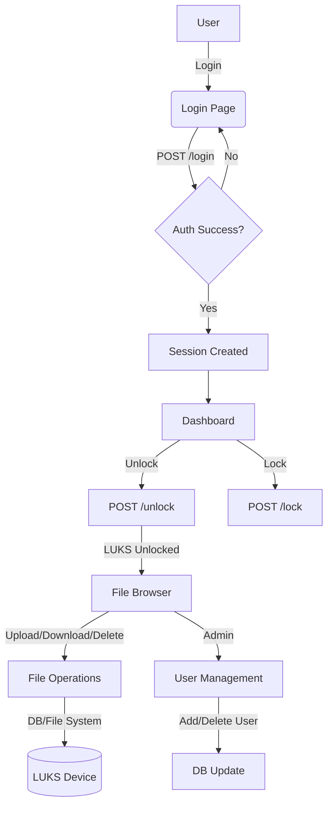
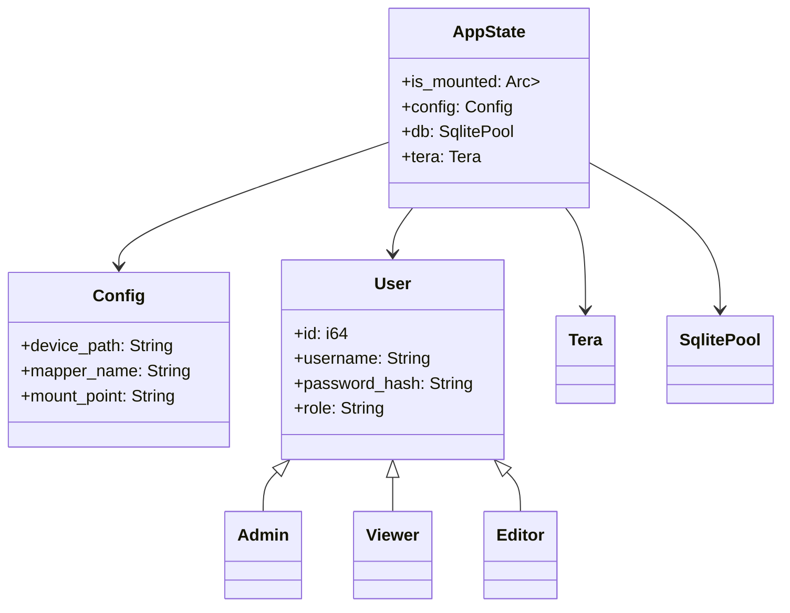

# LUKS Web Manager (Enhanced Edition)

A modern, secure, and feature-rich self-hosted web interface for managing LUKS (Linux Unified Key Setup) encrypted drives, written in Rust. This project provides a responsive web UI for encrypted device management, user authentication, and advanced file operations, all with strong security best practices.

---

## Application Flow Diagram



---

## Core Data Structures/Class Diagram



---

## Version History

### v0.1.3
- Added `/delete_json` endpoint for multiple file deletions
- Frontend can now delete multiple selected files
- Authentication and path validation for each deletion
- Detailed logging for all deletion attempts

### v0.1.2
- Improved multiple file upload support (drag-and-drop, file picker)
- Fixed frontend response handling for uploads
- Enhanced error handling and debugging for uploads

### v0.1.1
- Fixed cross-device link error for uploads
- Authentication required for file uploads
- Improved upload destination validation and error feedback

### v0.1.0
- Initial release: LUKS device management, user authentication, file browser, admin panel, and security features

---

# New Features and Enhancements

### Modern User Interface
- Clean and intuitive design.
- Responsive layout optimized for various devices.
- Dark/Light mode toggle with persistent preference.

### Advanced File Management
- Drag-and-drop uploads with progress indicators.
- Multi-file operations: batch actions for selected files.
- Right-click context menu for quick access to operations.

### Security Features
- Secure Argon2 password hashing.
- Session management with secure cookies.
- Rate limiting for authentication attempts to prevent brute force attacks.
- Configuration validation with comprehensive error logging.

## Core Features

### LUKS Device Management
- Remote control for unlocking and mounting encrypted devices.
- Real-time status monitoring.
- Automatic detection of system mount states.

### Usage and Configuration

#### HTTPS Configuration
- Use Nginx or Apache as a reverse proxy for HTTPS.

#### Rate Limiting
- Configure rate limiting to protect endpoints from abuse.

#### Logging and Validation
- Enhanced error handling with proper logging mechanisms.

## License

This project is open source. Please check the license file for details.

## 🔧 Latest Updates & Fixes

### **File Upload Fix (v0.1.1)**
- **✅ Fixed**: Cross-device link error when uploading files
- **✅ Added**: Authentication requirement for file uploads  
- **✅ Enhanced**: Better error handling and logging for uploads
- **✅ Improved**: Upload destination validation

### **Upload Improvements:**
- **Cross-filesystem Support**: Now uses file copying instead of moving to avoid "Invalid cross-device link" errors
- **Authentication Required**: Users must be logged in to upload files
- **Better Error Messages**: Clear feedback when LUKS device is not mounted
- **Enhanced Logging**: Detailed upload success/failure logs
- **Path Validation**: Prevents directory traversal attacks

### **Testing Upload Functionality:**
1. **Start the server**: `cargo run`
2. **Login** via web interface (admin/password)
3. **Mount LUKS device** (if using real LUKS storage)
4. **Upload files** via drag-and-drop or upload button

### **For Testing Without LUKS:**
```bash
export LUKS_MOUNT_POINT=/tmp/test_uploads
mkdir -p /tmp/test_uploads
cargo run
```

---


## 🔧 Multiple File Upload Fix (v0.1.2)

### **✅ Fixed Issues:**
- **Multiple File Selection**: Now properly handles selecting multiple files
- **Frontend Response Handling**: Fixed JavaScript to handle 302 redirects correctly  
- **File List Preservation**: Uses DataTransfer API to maintain file selections
- **Enhanced Debugging**: Added console logs for upload tracking

### **🛠️ Technical Improvements:**
- **JavaScript FormData**: Improved multiple file handling in frontend
- **Response Processing**: Fixed handling of server redirects (302 status)
- **File Input Management**: Better preservation of selected files using DataTransfer API
- **Error Handling**: Enhanced error reporting with detailed console logs

### **📋 Multiple Upload Features:**
- ✅ **Drag and Drop**: Select multiple files via drag-and-drop
- ✅ **File Picker**: Use Ctrl+click or Shift+click to select multiple files
- ✅ **Progress Feedback**: Shows upload progress and file count
- ✅ **Error Recovery**: Proper error handling and user feedback
- ✅ **Debug Console**: Detailed logging for troubleshooting

### **🧪 Testing Multiple File Upload:**
1. **Start server**: `cargo run`
2. **Login**: Use admin/password
3. **Select multiple files**: 
   - Use file picker with Ctrl+click
   - Or drag multiple files to upload zone
4. **Upload**: Click "Upload" button
5. **Verify**: Check console for detailed upload logs

### **🔍 Debug Information:**
The upload now provides detailed console logs:
```
Uploading 3 files:
File 1: document.pdf (245.2 KB)
File 2: image.jpg (892.1 KB)  
File 3: data.csv (45.8 KB)
Upload response status: 302
Upload successful
```

---


## 🔧 Multiple File Deletion Fix (v0.1.3)

### **✅ Issue Resolved:**
- **Missing Endpoint**: Added `/delete_json` endpoint for multiple file deletions
- **Frontend Integration**: Frontend can now successfully delete multiple selected files
- **Authentication**: JSON delete endpoint includes proper authentication checks
- **Error Handling**: Detailed error messages and success confirmations

### **🛠️ Technical Implementation:**
- **New Endpoint**: `/delete_json` - JSON API for deleting individual files
- **Batch Processing**: Frontend sends multiple simultaneous requests for selected files
- **Security**: Path validation and authentication checks for each deletion
- **Logging**: Detailed logging for successful and failed deletions

### **📋 Multiple Deletion Features:**
- ✅ **Select Multiple Files**: Use checkboxes to select files/folders
- ✅ **Batch Delete**: Delete multiple items with single "Delete Selected" action
- ✅ **Progress Feedback**: Shows deletion progress and results
- ✅ **Error Recovery**: Individual file errors don't stop other deletions
- ✅ **Confirmation Dialog**: Asks for confirmation before deleting

### **🔍 How It Works:**
1. **Frontend**: User selects multiple files with checkboxes
2. **Confirmation**: System asks "Delete X selected file(s)?"
3. **Batch Processing**: Sends individual DELETE requests for each file
4. **Result**: Shows success/failure count for the operation

### **🧪 Testing Multiple File Deletion:**
1. **Start server**: `cargo run`
2. **Login**: Use admin/password
3. **Select files**: Check multiple file checkboxes
4. **Delete**: Click "Delete Selected" button
5. **Verify**: Check logs for individual deletion confirmations

### **📊 API Response Format:**
```json
{
  "success": true,
  "message": "Deleted filename.txt"
}
```

### **🔒 Security Features:**
- **Authentication Required**: Must be logged in to delete files
- **Path Validation**: Prevents deletion outside mount point
- **Individual Validation**: Each file deletion is separately validated
- **Detailed Logging**: All deletion attempts are logged with results

---

