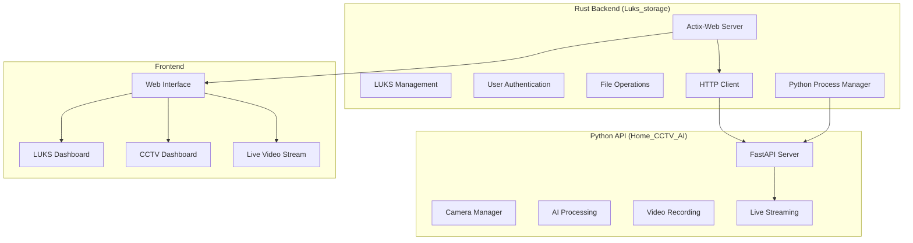

# LUKS Web Manager - Phase 2 Integration 🔧

A modern, secure, and feature-rich self-hosted web interface for managing LUKS (Linux Unified Key Setup) encrypted drives, written in Rust. **Now integrating with Home_CCTV_AI system for comprehensive surveillance and storage management.**

---

## 🎯 Project Status - Phase 2 Integration

### ✅ Phase 1: Home_CCTV_AI API (COMPLETED)
- **✅ FastAPI Server**: Fully functional API server with all endpoints
- **✅ Multi-Camera Support**: RTSP, USB, and file-based camera sources
- **✅ AI Processing**: Object detection, motion detection, face recognition  
- **✅ Video Recording**: Event-triggered recording with circular buffer
- **✅ Live Streaming**: Real-time MJPEG video streams
- **✅ Production Ready**: Refactored and optimized for integration

### 🔄 Phase 2: Rust Backend Integration (IN PROGRESS)
- **⏳ Python Process Management**: Rust subprocess handling for Python API
- **⏳ HTTP Client**: reqwest crate integration for API communication
- **⏳ Rust API Client**: Communication layer between Rust and Python
- **⏳ Secure Proxy Endpoints**: Backend endpoints for frontend integration
- **⏳ Authentication Bridge**: Unified auth between LUKS and CCTV systems

### 📋 Phase 3: Frontend UI Development (PLANNED)
- **⏳ CCTV Management Page**: Integrated surveillance interface
- **⏳ Navigation Enhancement**: Seamless UI between storage and surveillance
- **⏳ Live Video Display**: Real-time camera feeds in web interface
- **⏳ Recordings Browser**: Video playback and management interface

---

## 🏗️ Integration Architecture



---

## 🚀 Current Features (v0.1.4)

### LUKS Storage Management
- **Encrypted Drive Control**: Remote unlocking and mounting
- **File Browser**: Comprehensive file management with drag-drop uploads
- **Multi-file Operations**: Batch upload, download, and deletion
- **User Management**: Role-based access control (Admin, Editor, Viewer)
- **Security**: Argon2 password hashing, session management, rate limiting

### File Operations (Enhanced)
- **✅ Multiple File Upload**: Drag-and-drop with progress indicators
- **✅ Batch File Deletion**: Multi-select delete with confirmation
- **✅ Cross-device Support**: Handles different filesystem operations
- **✅ Path Validation**: Security checks prevent directory traversal
- **✅ Authentication**: All operations require proper authentication

### Integration Preparation
- **⏳ Process Management**: Rust subprocess control for Python services
- **⏳ API Communication**: HTTP client for internal service communication  
- **⏳ Unified Authentication**: Single sign-on across both systems
- **⏳ Resource Management**: Coordinated resource usage and monitoring

---

## 📋 Phase 2 Implementation Plan

### 2.1: Python Process Management
```rust
// Planned implementation in src/cctv_manager.rs
pub struct CctvManager {
    process: Option<Child>,
    api_url: String,
    client: reqwest::Client,
}

impl CctvManager {
    pub async fn start_api_server(&mut self) -> Result<(), CctvError>
    pub async fn stop_api_server(&mut self) -> Result<(), CctvError>
    pub async fn health_check(&self) -> Result<bool, CctvError>
}
```

### 2.2: HTTP Client Integration  
```rust
// Add to Cargo.toml
reqwest = { version = "0.11", features = ["json"] }
tokio-process = "0.2"
serde_json = "1.0"
```

### 2.3: API Endpoints
```rust
// Planned routes in src/main.rs
app.route("/api/cctv/status", web::get().to(cctv_status))
app.route("/api/cctv/cameras", web::get().to(list_cameras))  
app.route("/api/cctv/stream/{camera_id}", web::get().to(video_stream))
app.route("/api/cctv/recordings", web::get().to(list_recordings))
```

### 2.4: Database Schema Updates
```sql
-- Planned migration for CCTV integration
CREATE TABLE cctv_cameras (
    id INTEGER PRIMARY KEY,
    camera_id TEXT NOT NULL UNIQUE,
    name TEXT NOT NULL,
    url TEXT NOT NULL,
    enabled BOOLEAN DEFAULT true,
    created_at DATETIME DEFAULT CURRENT_TIMESTAMP
);

CREATE TABLE cctv_settings (
    id INTEGER PRIMARY KEY,
    key TEXT NOT NULL UNIQUE,
    value TEXT NOT NULL,
    updated_at DATETIME DEFAULT CURRENT_TIMESTAMP
);
```

---

## 🛠️ Development Setup

### Prerequisites
- Rust 1.70+
- Python 3.7+
- SQLite 3.x
- OpenCV (for CCTV functionality)

### Build and Run
```bash
# Clone and setup
git checkout phase-2-rust-integration

# Install Rust dependencies
cargo build

# Setup Python environment (for CCTV API)
cd ../Home_CCTV_AI
python -m venv venv
source venv/bin/activate
pip install -r requirements.txt

# Run integrated system (Phase 2 goal)
cd ../Luks_storage
cargo run
```

### Environment Variables
```bash
# LUKS Configuration
export LUKS_DEVICE_PATH="/dev/sdb1"
export LUKS_MAPPER_NAME="encrypted_volume"  
export LUKS_MOUNT_POINT="/mnt/secure_data"
export DATABASE_URL="sqlite:luks_manager.db"

# CCTV Integration (Phase 2)
export CCTV_API_PORT=8082
export CCTV_API_HOST="127.0.0.1"
export CCTV_PYTHON_PATH="../Home_CCTV_AI"
```

---

## 🔧 Recent Updates

### **Phase 2 Initiation (v0.1.4)**
- **🚀 Project Structure**: Prepared for CCTV integration
- **🔧 Branch Management**: Created phase-2-rust-integration branch
- **📝 Documentation**: Updated README with integration roadmap
- **🎯 Architecture**: Designed integration architecture and data flow

### **Multiple File Deletion (v0.1.3)**  
- **✅ JSON API**: Added `/delete_json` endpoint for batch operations
- **✅ Frontend Integration**: Multi-select deletion with confirmations
- **✅ Security**: Authentication and path validation for each operation
- **✅ Error Handling**: Detailed logging and error reporting

### **File Upload Enhancements (v0.1.2)**
- **✅ Multiple Files**: Drag-drop and multi-select file uploads
- **✅ Progress Tracking**: Real-time upload progress indicators
- **✅ Error Recovery**: Robust error handling and user feedback
- **✅ Cross-device Support**: Handles different filesystem operations

---

## 🔮 Integration Goals (Phase 2)

### Unified System Benefits
1. **Single Interface**: Manage both encrypted storage and surveillance from one UI
2. **Secure Recording**: Store CCTV recordings on encrypted LUKS drives
3. **Centralized Auth**: Single login for both storage and surveillance features
4. **Resource Optimization**: Coordinated resource usage and monitoring
5. **Enhanced Security**: Encrypted storage for sensitive surveillance data

### API Integration Points
- **Camera Management**: Configure and control cameras through web interface  
- **Live Streaming**: Real-time video feeds embedded in storage dashboard
- **Recording Storage**: CCTV recordings automatically stored on LUKS drives
- **Event Notifications**: Motion/detection events integrated with file system
- **User Permissions**: Role-based access to both storage and surveillance features

---

**Current Branch**: `phase-2-rust-integration`  
**Integration Status**: 🔄 **IN PROGRESS** - Rust backend integration with Python API  
**Next Milestone**: Complete subprocess management and HTTP client implementation

---

## 📞 Support

For Phase 2 development questions or integration support:
- Review the integration architecture diagram
- Check the implementation plan in each phase section  
- Refer to the Home_CCTV_AI `phase-1-api-complete` branch for API details

